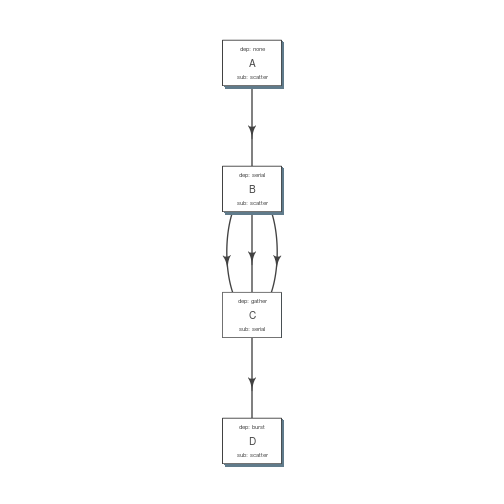

---
<<<<<<< HEAD
title: "Building Pipelines"
=======
title: "flowr simple pipelines"
>>>>>>> origin/gh-pages
date: "2015-08-25"
output: rmarkdown::html_document
vignette: >
  %\VignetteIndexEntry{flowr simple example}
  %\VignetteEngine{knitr::rmarkdown}
  \usepackage[utf8]{inputenc}
---


# Building Pipelines

An easy and quick way to build a workflow is create two separate files. First is a table with commands to run, second has details regarding how the modules are stitched together. In the rest of this document we would refer to them as flow_mat and flow_def respectively.

Both these files have a `jobname` column which is used as a ID to connect them to each other.

## Ingredients


```r
## ------ load some example data
ex = file.path(system.file(package = "flowr"), "pipelines")
flow_mat = as.flowmat(file.path(ex, "sleep_pipe.tsv"))
flow_def = as.flowdef(file.path(ex, "sleep_pipe.def"))
```


### 1. Flow Definition

Each row in this table refers to one step of the pipeline. It describes the resources used by this step and also its relationship with other steps.
Especially, the step immediately prior to it.


It is a tab separated file, with a minimum of 4 columns:

- `jobname`: Name of the step
- `sub_type`: Short for submission type, refers to, how should multiple commands of this step be submitted. Possible values are `serial` or `scatter`.
- `prev_job`: Short for previous job, this would be jobname of the previous job. This can be NA/./none if this is a independent/initial step, and no previous step is required for this to start. 
- `dep_type`: Short for dependency type, refers to the relationship of this job with the one defined in `prev_job`. This can take values `none`, `gather`, `serial` or `burst`.

These would be explained in detail, below.

Apart from the above described variables, several others defining the resource requirements of each step are also available. These give great amount of flexibility to the user in choosing CPU, wall time, memory and queue for each step (and are passed along to the HPCC platform). 

- `cpu_reserved`
- `memory_reserved`
- `nodes`
- `walltime`
- `queue`

.. note:: 
This is especially useful for genomics pipelines, since each step may use different amount of resources. For example, in a typical setup, if one step uses 16 cores these would be blocked and not used during processing of several other steps. Thus resulting in blockage and high cluster load (even when actual CPU usage may be low). Being able to tune them, makes this setup quite efficient.

Most cluster platforms accept these resource arguments. Essentially a file like [this](https://github.com/sahilseth/flowr/blob/master/inst/conf/torque.sh) is used as a template, and variables defined in curly braces ( ex. `{{{CPU}}}` ) are filled up using the flow definition file.

.. warning:: 
If these (resource requirements) columns not included in the flow_def, their values should be explicitly defined in the submission template. 

Here is an example of a typical [flow_def](https://raw.githubusercontent.com/sahilseth/flowr/master/inst/pipelines/sleep_pipe.def) file.


|jobname    |sub_type |prev_jobs  |dep_type |queue | memory_reserved|walltime | cpu_reserved|platform | jobid|
|:----------|:--------|:----------|:--------|:-----|---------------:|:--------|------------:|:--------|-----:|
|sleep      |scatter  |none       |none     |short |            2000|1:00     |            1|torque   |     1|
|create_tmp |scatter  |sleep      |serial   |short |            2000|1:00     |            1|torque   |     2|
|merge      |serial   |create_tmp |gather   |short |            2000|1:00     |            1|torque   |     3|
|size       |serial   |merge      |serial   |short |            2000|1:00     |            1|torque   |     4|


<!-- Each row of this table translates to a call to ([job](http://docs.flowr.space/build/html/rd/topics/job.html) or) [queue](http://docs.flowr.space/build/html/rd/topics/queue.html) function. -->

<!-- 
- jobname: is passed as `name` argument to job().
- prev_jobs: passed as `previous_job` argument  to job().
- dep_type: passed as `dependency_type` argument  to job(). Possible values: gather, serial
- sub_type: passed as `submission_type` argument  to job().
- queue: name of the queue to be used for this particular job. 
	Since each jobs can be submitted to a different queue, this makes your flow very flexible
- memory_reserved: Refer to your system admin guide on what values should go here. 
	Some pipelines: 160000, 16g etc representing a 16GB reservation of RAM
- walltime: How long would this job run. Again refer to your HPCC guide. Example: 24:00, 24:00:00
- cpu_reserved: Amount of CPU reserved.

Its best to have this as a tab seperated file (with no row.names). -->


### 2. Flow mat: A table with shell commands to run

This is also a tab separated table, with a minimum of three columns as defined below:

- `samplename`: A grouping column. The table is split using this column and each subset is treated as a individual flow. This makes it very easy to process multiple samples using a single submission command.
	- If all the commands are for a single sample, one can just repeat a dummy name like sample1 all throughout.
- `jobname`: This corresponds to the name of the step. This should match exactly with the jobname column in flow_def table defined above.
- `cmd`: A shell command to run. One can get quite creative here. These could be multiple shell commands separated by a `;` or `&&`, more on this [here](http://stackoverflow.com/questions/3573742/difference-between-echo-hello-ls-vs-echo-hello-ls). Though to keep this clean you may just wrap a multi-line command into a script and just source the bash script from here.

Here is an example [flow_mat](https://github.com/sahilseth/flowr/blob/master/inst/pipelines/sleep_pipe.tsv).


|samplename |jobname    |cmd                                                            |
|:----------|:----------|:--------------------------------------------------------------|
|sample1    |sleep      |sleep 10 && sleep 2;echo hello                                 |
|sample1    |sleep      |sleep 11 && sleep 8;echo hello                                 |
|sample1    |sleep      |sleep 11 && sleep 17;echo hello                                |
|sample1    |create_tmp |head -c 100000 /dev/urandom > sample1_tmp_1                    |
|sample1    |create_tmp |head -c 100000 /dev/urandom > sample1_tmp_2                    |
|sample1    |create_tmp |head -c 100000 /dev/urandom > sample1_tmp_3                    |
|sample1    |merge      |cat sample1_tmp_1 sample1_tmp_2 sample1_tmp_3 > sample1_merged |
|sample1    |size       |du -sh sample1_merged; echo MY shell: $SHELL                   |


<!---
### Style 2

This style may be more suited for people who like to explore more advanced usage and like to code in R. Also this one find this much faster if jobs and their relationships changes a lot.

Here instead of seperating cmds and definitions one defines them step by step incrementally.

- Use: queue(), to define the computing cluster being used
- Use: multiple calls job()
- Use: flow() to stich the jobs into a flow.


Currently we support LSF, Torque and SGE. Let us use LSF for this example.


```r
qobj <- queue(platform = "lsf", queue = "normal", verbose = FALSE)
```

Let us stitch a simple flow with three jobs, which are submitted one after the other.


```r
job1 <- job(name = "myjob1", cmds = "sleep1", q_obj = qobj)
job2 <- job(name = "myjob2", cmds = "sleep2", q_obj = qobj, previous_job = "myjob1", dependency_type = "serial")
job3 <- job(name = "myjob3", cmds = "sleep3", q_obj = qobj, previous_job = "myjob1", dependency_type = "serial")
fobj <- flow(name = "myflow", jobs = list(job1, job2, job3), desc="description")
plot_flow(fobj)
```

The above translates to a flow definition which looks like this:


```r
dat <- flowr:::create_jobs_mat(fobj)
knitr:::kable(dat)
```
--->

### Example:

A   ----> B  -----> C -----> D

Consider an example with three steps A, B and C. A has 10 commands from A1 to A10, similarly B has 10 commands B1 through B10 and C has a single command, C1.

Consider another step D (with D1-D3), which comes after C.

## Submission types

> *This refers to the sub_type column in flow definition.*

- `scatter`: submit all commands as parallel, independent jobs. 
	- *Submit A1 through A10 as independent jobs*
- `serial`: run these commands sequentially one after the other. 
	- *Wrap A1 through A10, into a single job.*

## Dependency types

> *This refers to the dep_type column in flow definition.*

- `none`: independent job. 
	- *Initial step A has no dependency*
- `serial`: *one to one* relationship with previous job. 
	- *B1 can start as soon as A1 completes.*
- `gather`: *many to one*, wait for **all** commands in previous job to finish then start the  current step. 
	- *All jobs of B (1-10), need to complete before C1 is started*
- `burst`: *one to many* wait for the previous step which has one job and start processing all cmds in the current step. 
	- *D1 to D3 are started as soon as C1 finishes.*


## Relationships

Using the above submission and dependency types one can create several types of relationships between former and later jobs. Here are a few pipelines of relationships one may typically use.


### Serial: one to one relationship

[scatter] ---serial---> [scatter]

A is submitted as scatter, A1 through A10. Further B1, requires A1 to complete; B2 requires A2 and so on, but they need not wait for all of step A jobs to complete. Also B1 through B10 are independent of each other.

To set this up, A and B would have `sub_type` `scatter` and B would have `dep_type` as `serial`. Further, since A is an initial step its `dep_type` and `prev_job` would defined as `none`.


### Gather: many to one relationship

[scatter] ---gather---> [serial]

Since C is a single command which requires all steps of B to complete, intuitively it needs to `gather` pieces of data generated by B. In this case `dep_type` would be `gather` and `sub_type` type would be `serial` since it is a single command.


<!---
- makes sense when previous job had many commands running in parallel and current job would wait for all
- so previous job submission: `scatter`, and current job's dependency type `gather`

--->

### Burst: one to many relationship

[serial] ---burst---> [scatter]


Further, D is a set of three commands (D1-D3), which need to wait for a single process (C1) to complete. They would be submitted as `scatter` after waiting on C in a `burst` type dependency.


<!---
- makes sense when previous job had one command current job would split and submit several jobs in parallel
- so previous job submission_type: `serial`, and current job's dependency type `burst`, with a submission type: `scatter`

--->

In essence and example flow_def would look like as follows (with additional resource requirements not shown for brevity).


```r
ex2def = as.flowdef(file.path(ex, "abcd.def"))
ex2mat = as.flowmat(file.path(ex, "abcd.tsv"))
fobj = suppressMessages(to_flow(x = ex2mat, def = ex2def))
kable(ex2def[, 1:4])
```


|jobname |sub_type |prev_jobs |dep_type |
|:-------|:--------|:---------|:--------|
|A       |scatter  |none      |none     |
|B       |scatter  |A         |serial   |
|C       |serial   |B         |gather   |
|D       |scatter  |C         |burst    |

```r
plot_flow(fobj)
```

 

.. note:: 
	There is a darker more prominent shadow to indicate 
	scatter steps.


## Passing of flow definition resource columns

The resource requirement columns of flow definition are passed along to the final (cluster) submission script.

The following table provides a mapping between the flow definition columns and variables in the submission template ([pipelines below](#flow-def-columns)).


|flow_def_column |hpc_script_variable |
|:---------------|:-------------------|
|nodes           |NODES               |
|cpu_reserved    |CPU                 |
|memory_reserved |MEMORY              |
|email           |EMAIL               |
|walltime        |WALLTIME            |
|extra_opts      |EXTRA_OPTS          |
|*               |JOBNAME             |
|*               |STDOUT              |
|*               |CWD                 |
|*               |DEPENDENCY          |
|*               |TRIGGER             |
|**              |CMD                 |

\*: These are generated on the fly
\**: This is gathered from flow_mat


# Available Pipelines

Here are some of the available piplines along with their respective locations


```
#> Please supply a name of the pipline to run, here are the options
```


|name                    |def                  |conf                  |pipe                                                                             |
|:-----------------------|:--------------------|:---------------------|:--------------------------------------------------------------------------------|
|sleep_pipe              |sleep_pipe.def       |NA                    |/Users/sahilseth/Dropbox2/Dropbox/public/github_flow/inst/pipelines/sleep_pipe.R |
|fastq_bam_bwa           |NA                   |NA                    |/Users/sahilseth/Rlibs/ngsflows/pipelines/fastq_bam_bwa.R                        |
|fastq_bam_rna_ion       |NA                   |NA                    |/Users/sahilseth/Rlibs/ngsflows/pipelines/fastq_bam_rna_ion.R                    |
|fastq_bam_variants      |NA                   |NA                    |/Users/sahilseth/Rlibs/ngsflows/pipelines/fastq_bam_variants.R                   |
|fastq_haplotyper        |fastq_haplotyper.def |fastq_haplotyper.conf |/Users/sahilseth/Rlibs/ngsflows/pipelines/fastq_haplotyper.R                     |
|fastq_star_rna          |NA                   |NA                    |/Users/sahilseth/Rlibs/ngsflows/pipelines/fastq_star_rna.R                       |
|old_bam_pindel          |NA                   |NA                    |/Users/sahilseth/Rlibs/ngsflows/pipelines/old_bam_pindel.R                       |
|old_bam_preprocess      |NA                   |NA                    |/Users/sahilseth/Rlibs/ngsflows/pipelines/old_bam_preprocess.R                   |
|old_bam_xenome          |NA                   |NA                    |/Users/sahilseth/Rlibs/ngsflows/pipelines/old_bam_xenome.R                       |
|old_bwa_pipe            |NA                   |NA                    |/Users/sahilseth/Rlibs/ngsflows/pipelines/old_bwa_pipe.R                         |
|old_dna_qc              |NA                   |NA                    |/Users/sahilseth/Rlibs/ngsflows/pipelines/old_dna_qc.R                           |
|old_fastq_bam_bwa2      |NA                   |NA                    |/Users/sahilseth/Rlibs/ngsflows/pipelines/old_fastq_bam_bwa2.R                   |
|old_fastq_bismark_meth  |NA                   |NA                    |/Users/sahilseth/Rlibs/ngsflows/pipelines/old_fastq_bismark_meth.R               |
|old_flow_bam_preprocess |NA                   |NA                    |/Users/sahilseth/Rlibs/ngsflows/pipelines/old_flow_bam_preprocess.R              |
|old_proc_bwa_pipe       |NA                   |NA                    |/Users/sahilseth/Rlibs/ngsflows/pipelines/old_proc_bwa_pipe.R                    |
|split_aln_merge         |split_aln_merge.def  |NA                    |/Users/sahilseth/Rlibs/ngsflows/pipelines/split_aln_merge.R                      |
|build-pipes             |NA                   |NA                    |/Users/sahilseth/Dropbox2/Dropbox/public/github_flow/vignettes/build-pipes.R     |
|example_sleep           |NA                   |NA                    |/Users/sahilseth/Dropbox2/Dropbox/public/github_flow/vignettes/example_sleep.R   |
|quick-start             |NA                   |NA                    |/Users/sahilseth/Dropbox2/Dropbox/public/github_flow/vignettes/quick-start.R     |


# Cluster Support

Support for several popular cluster platforms are built-in. There is a template, for each platform, which should would out of the box.
Further, one may copy and edit them (and save to `~/flowr/conf`) in case some changes are required. Templates from this folder (`~/flowr/conf`), would override defaults.

Here are links to latest templates on github:

- [torque](https://github.com/sahilseth/flowr/blob/master/inst/conf/torque.sh)
- [lsf](https://github.com/sahilseth/flowr/blob/master/inst/conf/lsf.sh)
- [moab](https://github.com/sahilseth/flowr/blob/master/inst/conf/moab.sh)
- [sge](https://github.com/sahilseth/flowr/blob/master/inst/conf/sge.sh)
- [slurm](https://github.com/sahilseth/flowr/blob/master/inst/conf/slurm.sh), needs testing


Adding a new plaform involves [a few steps](https://github.com/sahilseth/flowr/issues/7) including support for:

1. submission: Template used for submission:
https://github.com/sahilseth/flowr/blob/master/inst/conf/torque.sh
2. [parse_jobids()](https://github.com/sahilseth/flowr/blob/master/R/parse-jobids.R): The job ids should parse using regular expression as provided by:
https://github.com/sahilseth/flowr/blob/master/inst/conf/flowr.conf
3. parse_dependency(): These are then parsed to create a dependency string, as seen here:
https://github.com/sahilseth/flowr/blob/master/R/parse-dependency.R
4. job(): Add a new class using the platform name. This is essentially a wrapper around job class.
https://github.com/sahilseth/flowr/blob/master/R/class-def.R
A one line like: `setClass("torque", contains = "job")` would suffice.
5. Killing jobs: making sure that the correct job killing command is identified by detect_kill_cmd().

.. note:: 
 	My HPCC is not supported, how to make it work? re-open this issue, with details on the platform.
 	[adding platforms](https://github.com/sahilseth/flowr/issues/7)
 	

As of now we have tested this on the following clusters:


|Platform |command |status     |queue.type |
|:--------|:-------|:----------|:----------|
|LSF 7    |bsub    |Not tested |lsf        |
|LSF 9.1  |bsub    |Yes        |lsf        |
|Torque   |qsub    |Yes        |torque     |
|SGE      |qsub    |Beta       |sge        |
|SLURM    |sbatch  |under-dev  |slurm      |

\*queue short-name used in [flow](https://github.com/sahilseth/flow)

There are several [job scheduling](http://en.wikipedia.org/wiki/Job_scheduler) systems
available and we try to support the major players. Adding support is
quite easy if we have access to them. Your favourite not in the list?
Send a [message](mailto:sahil.seth@me.com)

- PBS: [wiki](http://en.wikipedia.org/wiki/Portable_Batch_System)
- Torque: [wiki](http://en.wikipedia.org/wiki/TORQUE_Resource_Manager)
	- MD Anderson
	- [University of Houston](http://www.rcc.uh.edu/hpc-docs/49-using-torque-to-submit-and-monitor-jobs.html)
- LSF [wiki](http://en.wikipedia.org/wiki/Platform_LSF):
	- Harvard Medicla School uses: [LSF HPC 7](https://wiki.med.harvard.edu/Orchestra/IntroductionToLSF)
	- Also Used at [Broad](https://www.broadinstitute.org/gatk/guide/article?id=1311)
- SGE [wiki](http://en.wikipedia.org/wiki/Sun_Grid_Engine)
	- A tutorial for [Sun Grid Engine](https://sites.google.com/site/anshulkundaje/inotes/programming/clustersubmit/sun-grid-engine)
	- Another from [JHSPH](http://www.biostat.jhsph.edu/bit/cluster-usage.html)
	- Dependecy info [here](https://wiki.duke.edu/display/SCSC/SGE+Job+Dependencies)


[Comparison_of_cluster_software](http://en.wikipedia.org/wiki/Comparison_of_cluster_software)


