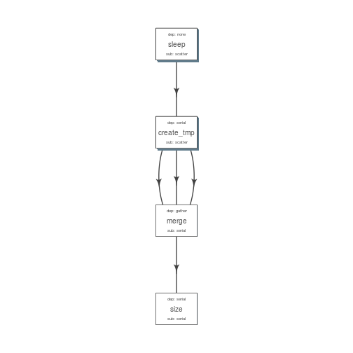

Get started
===========

.. code:: r

    install.packages('devtools')
    devtools::install_github("sahilseth/flowr")

Run a setup function which copies 'flowr' helper script to enable using flow from shell terminal itself. A few examples `here <https://github.com/sahilseth/rfun>`__.

.. code:: r

    library(flowr)

.. code:: r

    setup()

Toy example
-----------

.. figure:: imgs/toy.png
   :alt: 

A simple example where we have three instances of sleep (wait for few seconds), after completion three tmp jobs are started which create files with some random data. After all these are complete, a merge step follows, which combines them into one big file. Next we use ``du`` to calculate the size of the resulting file.

.. note:: This is quite similar in structure to a typical workflow from where a series of alignment and sorting steps may take place on the raw fastq files. Followed by merging of the resulting bam files into one large file per-sample and further downstream processing.

The table below is referred to as `flow\_mat <http://docs.flowr.space/en/latest/rd/vignettes/build-pipes.html#flow-mat-a-table-with-shell-commands-to-run>`__.

+--------------+---------------+-------------------------------------------------------------------------+
| samplename   | jobname       | cmd                                                                     |
+==============+===============+=========================================================================+
| sample1      | sleep         | sleep 10 && sleep 2;echo hello                                          |
+--------------+---------------+-------------------------------------------------------------------------+
| sample1      | sleep         | sleep 11 && sleep 8;echo hello                                          |
+--------------+---------------+-------------------------------------------------------------------------+
| sample1      | sleep         | sleep 11 && sleep 17;echo hello                                         |
+--------------+---------------+-------------------------------------------------------------------------+
| sample1      | create\_tmp   | head -c 100000 /dev/urandom > sample1\_tmp\_1                           |
+--------------+---------------+-------------------------------------------------------------------------+
| sample1      | create\_tmp   | head -c 100000 /dev/urandom > sample1\_tmp\_2                           |
+--------------+---------------+-------------------------------------------------------------------------+
| sample1      | create\_tmp   | head -c 100000 /dev/urandom > sample1\_tmp\_3                           |
+--------------+---------------+-------------------------------------------------------------------------+
| sample1      | merge         | cat sample1\_tmp\_1 sample1\_tmp\_2 sample1\_tmp\_3 > sample1\_merged   |
+--------------+---------------+-------------------------------------------------------------------------+
| sample1      | size          | du -sh sample1\_merged; echo MY shell: $SHELL                           |
+--------------+---------------+-------------------------------------------------------------------------+

We use an additional file specifying relationship between the steps, and also other resource requirements `flow\_def <http://docs.flowr.space/en/latest/rd/vignettes/build-pipes.html#flow-definition>`__.

+---------------+-------------+---------------+-------------+---------+--------------------+------------+-----------------+------------+---------+
| jobname       | sub\_type   | prev\_jobs    | dep\_type   | queue   | memory\_reserved   | walltime   | cpu\_reserved   | platform   | jobid   |
+===============+=============+===============+=============+=========+====================+============+=================+============+=========+
| sleep         | scatter     | none          | none        | short   | 2000               | 1:00       | 1               | torque     | 1       |
+---------------+-------------+---------------+-------------+---------+--------------------+------------+-----------------+------------+---------+
| create\_tmp   | scatter     | sleep         | serial      | short   | 2000               | 1:00       | 1               | torque     | 2       |
+---------------+-------------+---------------+-------------+---------+--------------------+------------+-----------------+------------+---------+
| merge         | serial      | create\_tmp   | gather      | short   | 2000               | 1:00       | 1               | torque     | 3       |
+---------------+-------------+---------------+-------------+---------+--------------------+------------+-----------------+------------+---------+
| size          | serial      | merge         | serial      | short   | 2000               | 1:00       | 1               | torque     | 4       |
+---------------+-------------+---------------+-------------+---------+--------------------+------------+-----------------+------------+---------+

Stitch it
---------

.. code:: r

    fobj <- to_flow(x = flow_mat, def = as.flowdef(flow_def), 
        flowname = "example1", platform = "lsf")

Plot it
-------

.. code:: r

    plot_flow(fobj)

.. figure:: figure/plot_example1-1.png
   :alt: Flow chart describing process for example 1

   Flow chart describing process for example 1

Test it
-------

    Dry run (submit)

.. code:: r

    submit_flow(fobj)

::

    Test Successful!
    You may check this folder for consistency. Also you may re-run submit with execute=TRUE
     ~/flowr/type1-20150520-15-18-27-5mSd32G0

Submit it
---------

    Submit to the cluster !

.. code:: r

    submit_flow(fobj, execute = TRUE)

::

    Flow has been submitted. Track it from terminal using:
    flowr::status(x="~/flowr/type1-20150520-15-18-46-sySOzZnE")
    OR
    flowr status x=~/flowr/type1-20150520-15-18-46-sySOzZnE

Check its status
----------------

::

    flowr status x=~/flowr/type1-20150520-15-18-46-sySOzZnE

::

    Loading required package: shape
    Flowr: streamlining workflows
    Showing status of: /rsrch2/iacs/iacs_dep/sseth/flowr/type1-20150520-15-18-46-sySOzZnE


    |          | total| started| completed| exit_status|
    |:---------|-----:|-------:|---------:|-----------:|
    |001.sleep |    10|      10|        10|           0|
    |002.tmp   |    10|      10|        10|           0|
    |003.merge |     1|       1|         1|           0|
    |004.size  |     1|       1|         1|           0|

Killing a flow
--------------

::


    ## kill one flow
    ## flowr kill_flow x=flow_wd

    ## In case path matches multiple folders, flowr asks before killing
    kill(x='fastq_haplotyper*')
    ##  Flowr: streamlining workflows
    ##  found multiple wds:
    ##  ./fastq_haplotyper-MS132-20150825-16-24-04-0Lv1PbpI
    ##  /fastq_haplotyper-MS132-20150825-17-47-52-5vFIkrMD

    ##  Really kill all of them ? kill again with force=TRUE

    ## submitting again with force=TRUE will kill them:
    kill(x='fastq_haplotyper*', force = TRUE)
<<<<<<< HEAD

.. note:: Even if you want to kill the flow, its best to let submit\_flow do its job, when done simply use kill(flow\_wd). If submit\_flow is interrupted, flow detail files etc are not created, thus flowr can't associate submitted jobs with flow instance.

Re-run a flow
-------------

flowr also enables you to re-run a pipeline in case of hardware or software failures.

-  **hardware** no change to the pipeline is required, simply rerun it: ``rerun(x=flow_wd, start_from=<intermediate step>)``
-  **software** either a change to flowmat or flowdef has been made: ``rerun(x=flow_wd, mat = new_flowmat, def = new_flowdef, start_from=<intermediate step>)``

In either case there are two things which are always required, a flow\_wd (the folder created by flowr which contains execution logs) and name of the step from where we want to start execution. Refer to the `help section <http://docs.flowr.space/en/latest/rd/topics/complete-help.html>`__ for more details.

.. note:: Interested? Here are some details on `building pipelines <#building-pipelines>`__
=======

.. note:: Even if you want to kill the flow, its best to let submit\_flow do its job, when done simply use kill(flow\_wd). If submit\_flow is interrupted, flow detail files etc are not created, thus flowr can't associate submitted jobs with flow instance.

.. note:: Interested? Here are some details on `building pipelines <http://docs.flowr.space/en/latest/rd/vignettes/build-pipes.html>`__
>>>>>>> origin/gh-pages

Building Pipelines
==================

An easy and quick way to build a workflow is create two separate files. First is a table with commands to run, second has details regarding how the modules are stitched together. In the rest of this document we would refer to them as flow\_mat and flow\_def respectively.

Both these files have a ``jobname`` column which is used as a ID to connect them to each other.

Ingredients for building a pipeline
===================================

Essentially there are two main components which go into building a flowr pipeline, a flow matrix with commands to run and a flow definition with details regarding how to stich a pipeline.

Let us read some files to see what they look like and what they do.

.. code:: r

    ## ------ load some example data
    ex = file.path(system.file(package = "flowr"), "pipelines")
    flow_mat = as.flowmat(file.path(ex, "sleep_pipe.tsv"))
    flow_def = as.flowdef(file.path(ex, "sleep_pipe.def"))

1. Flow Definition
------------------

Each row in this table refers to one step of the pipeline. It describes the resources used by this step and also its relationship with other steps. Especially, the step immediately prior to it.

It is a tab separated file, with a minimum of 4 columns:

-  ``jobname``: Name of the step
-  ``sub_type``: Short for submission type, refers to, how should multiple commands of this step be submitted. Possible values are ``serial`` or ``scatter``.
-  ``prev_job``: Short for previous job, this would be jobname of the previous job. This can be NA/./none if this is a independent/initial step, and no previous step is required for this to start.
-  ``dep_type``: Short for dependency type, refers to the relationship of this job with the one defined in ``prev_job``. This can take values ``none``, ``gather``, ``serial`` or ``burst``.

These would be explained in detail, below.

Apart from the above described variables, several others defining the resource requirements of each step are also available. These give great amount of flexibility to the user in choosing CPU, wall time, memory and queue for each step (and are passed along to the HPCC platform).

-  ``cpu_reserved``
-  ``memory_reserved``
-  ``nodes``
-  ``walltime``
-  ``queue``

.. note:: This is especially useful for genomics pipelines, since each step may use different amount of resources. For example, in a typical setup, if one step uses 16 cores these would be blocked and not used during processing of several other steps. Thus resulting in blockage and high cluster load (even when actual CPU usage may be low). Being able to tune them, makes this setup quite efficient.

Most cluster platforms accept these resource arguments. Essentially a file like `this <https://github.com/sahilseth/flowr/blob/master/inst/conf/torque.sh>`__ is used as a template, and variables defined in curly braces ( ex. ``{{{CPU}}}`` ) are filled up using the flow definition file.

.. warning:: If these (resource requirements) columns not included in the flow\_def, their values should be explicitly defined in the submission template.

Here is an example of a typical `flow\_def <https://raw.githubusercontent.com/sahilseth/flowr/master/inst/pipelines/sleep_pipe.def>`__ file.

+---------------+-------------+---------------+-------------+---------+--------------------+------------+-----------------+------------+---------+
| jobname       | sub\_type   | prev\_jobs    | dep\_type   | queue   | memory\_reserved   | walltime   | cpu\_reserved   | platform   | jobid   |
+===============+=============+===============+=============+=========+====================+============+=================+============+=========+
| sleep         | scatter     | none          | none        | short   | 2000               | 1:00       | 1               | torque     | 1       |
+---------------+-------------+---------------+-------------+---------+--------------------+------------+-----------------+------------+---------+
| create\_tmp   | scatter     | sleep         | serial      | short   | 2000               | 1:00       | 1               | torque     | 2       |
+---------------+-------------+---------------+-------------+---------+--------------------+------------+-----------------+------------+---------+
| merge         | serial      | create\_tmp   | gather      | short   | 2000               | 1:00       | 1               | torque     | 3       |
+---------------+-------------+---------------+-------------+---------+--------------------+------------+-----------------+------------+---------+
| size          | serial      | merge         | serial      | short   | 2000               | 1:00       | 1               | torque     | 4       |
+---------------+-------------+---------------+-------------+---------+--------------------+------------+-----------------+------------+---------+

.. raw:: html

   <!-- Each row of this table translates to a call to ([job](http://docs.flowr.space/build/html/rd/topics/job.html) or) [queue](http://docs.flowr.space/build/html/rd/topics/queue.html) function. -->

.. raw:: html

   <!-- 
   - jobname: is passed as `name` argument to job().
   - prev_jobs: passed as `previous_job` argument  to job().
   - dep_type: passed as `dependency_type` argument  to job(). Possible values: gather, serial
   - sub_type: passed as `submission_type` argument  to job().
   - queue: name of the queue to be used for this particular job. 
       Since each jobs can be submitted to a different queue, this makes your flow very flexible
   - memory_reserved: Refer to your system admin guide on what values should go here. 
       Some pipelines: 160000, 16g etc representing a 16GB reservation of RAM
   - walltime: How long would this job run. Again refer to your HPCC guide. Example: 24:00, 24:00:00
   - cpu_reserved: Amount of CPU reserved.

   Its best to have this as a tab seperated file (with no row.names). -->

2. Flow mat: A table with shell commands to run
<<<<<<< HEAD
-----------------------------------------------
=======
~~~~~~~~~~~~~~~~~~~~~~~~~~~~~~~~~~~~~~~~~~~~~~~
>>>>>>> origin/gh-pages

This is also a tab separated table, with a minimum of three columns as defined below:

-  ``samplename``: A grouping column. The table is split using this column and each subset is treated as a individual flow. This makes it very easy to process multiple samples using a single submission command.

   -  If all the commands are for a single sample, one can just repeat a dummy name like sample1 all throughout.

-  ``jobname``: This corresponds to the name of the step. This should match exactly with the jobname column in flow\_def table defined above.
-  ``cmd``: A shell command to run. One can get quite creative here. These could be multiple shell commands separated by a ``;`` or ``&&``, more on this `here <http://stackoverflow.com/questions/3573742/difference-between-echo-hello-ls-vs-echo-hello-ls>`__. Though to keep this clean you may just wrap a multi-line command into a script and just source the bash script from here.

Here is an example `flow\_mat <https://github.com/sahilseth/flowr/blob/master/inst/pipelines/sleep_pipe.tsv>`__.

+--------------+---------------+-------------------------------------------------------------------------+
| samplename   | jobname       | cmd                                                                     |
+==============+===============+=========================================================================+
| sample1      | sleep         | sleep 10 && sleep 2;echo hello                                          |
+--------------+---------------+-------------------------------------------------------------------------+
| sample1      | sleep         | sleep 11 && sleep 8;echo hello                                          |
+--------------+---------------+-------------------------------------------------------------------------+
| sample1      | sleep         | sleep 11 && sleep 17;echo hello                                         |
+--------------+---------------+-------------------------------------------------------------------------+
| sample1      | create\_tmp   | head -c 100000 /dev/urandom > sample1\_tmp\_1                           |
+--------------+---------------+-------------------------------------------------------------------------+
| sample1      | create\_tmp   | head -c 100000 /dev/urandom > sample1\_tmp\_2                           |
+--------------+---------------+-------------------------------------------------------------------------+
| sample1      | create\_tmp   | head -c 100000 /dev/urandom > sample1\_tmp\_3                           |
+--------------+---------------+-------------------------------------------------------------------------+
| sample1      | merge         | cat sample1\_tmp\_1 sample1\_tmp\_2 sample1\_tmp\_3 > sample1\_merged   |
+--------------+---------------+-------------------------------------------------------------------------+
| sample1      | size          | du -sh sample1\_merged; echo MY shell: $SHELL                           |
+--------------+---------------+-------------------------------------------------------------------------+

.. raw:: html

   <!---
   ### Style 2

   This style may be more suited for people who like to explore more advanced usage and like to code in R. Also this one find this much faster if jobs and their relationships changes a lot.

   Here instead of seperating cmds and definitions one defines them step by step incrementally.

   - Use: queue(), to define the computing cluster being used
   - Use: multiple calls job()
   - Use: flow() to stich the jobs into a flow.


   Currently we support LSF, Torque and SGE. Let us use LSF for this example.


   ```r
   qobj <- queue(platform = "lsf", queue = "normal", verbose = FALSE)
   ```

   Let us stitch a simple flow with three jobs, which are submitted one after the other.


   ```r
   job1 <- job(name = "myjob1", cmds = "sleep1", q_obj = qobj)
   job2 <- job(name = "myjob2", cmds = "sleep2", q_obj = qobj, previous_job = "myjob1", dependency_type = "serial")
   job3 <- job(name = "myjob3", cmds = "sleep3", q_obj = qobj, previous_job = "myjob1", dependency_type = "serial")
   fobj <- flow(name = "myflow", jobs = list(job1, job2, job3), desc="description")
   plot_flow(fobj)
   ```

   The above translates to a flow definition which looks like this:


   ```r
   dat <- flowr:::create_jobs_mat(fobj)
   knitr:::kable(dat)
   ```
   --->

Example:
~~~~~~~~

A ----> B -----> C -----> D

Consider an example with three steps A, B and C. A has 10 commands from A1 to A10, similarly B has 10 commands B1 through B10 and C has a single command, C1.

Consider another step D (with D1-D3), which comes after C.

Submission types
================

    *This refers to the sub\_type column in flow definition.*

-  ``scatter``: submit all commands as parallel, independent jobs.

   -  *Submit A1 through A10 as independent jobs*

-  ``serial``: run these commands sequentially one after the other.

   -  *Wrap A1 through A10, into a single job.*

Dependency types
================

    *This refers to the dep\_type column in flow definition.*

-  ``none``: independent job.

   -  *Initial step A has no dependency*

-  ``serial``: *one to one* relationship with previous job.

   -  *B1 can start as soon as A1 completes.*

-  ``gather``: *many to one*, wait for **all** commands in previous job to finish then start the current step.

   -  *All jobs of B (1-10), need to complete before C1 is started*

-  ``burst``: *one to many* wait for the previous step which has one job and start processing all cmds in the current step.

   -  *D1 to D3 are started as soon as C1 finishes.*

Relationships
=============

Using the above submission and dependency types one can create several types of relationships between former and later jobs. Here are a few pipelines of relationships one may typically use.

Serial: one to one relationship
-------------------------------

[scatter] ---serial---> [scatter]

A is submitted as scatter, A1 through A10. Further B1, requires A1 to complete; B2 requires A2 and so on, but they need not wait for all of step A jobs to complete. Also B1 through B10 are independent of each other.

To set this up, A and B would have ``sub_type`` ``scatter`` and B would have ``dep_type`` as ``serial``. Further, since A is an initial step its ``dep_type`` and ``prev_job`` would defined as ``none``.

Gather: many to one relationship
--------------------------------

[scatter] ---gather---> [serial]

Since C is a single command which requires all steps of B to complete, intuitively it needs to ``gather`` pieces of data generated by B. In this case ``dep_type`` would be ``gather`` and ``sub_type`` type would be ``serial`` since it is a single command.

.. raw:: html

   <!---
   - makes sense when previous job had many commands running in parallel and current job would wait for all
   - so previous job submission: `scatter`, and current job's dependency type `gather`

   --->

Burst: one to many relationship
-------------------------------

[serial] ---burst---> [scatter]

Further, D is a set of three commands (D1-D3), which need to wait for a single process (C1) to complete. They would be submitted as ``scatter`` after waiting on C in a ``burst`` type dependency.

.. raw:: html

   <!---
   - makes sense when previous job had one command current job would split and submit several jobs in parallel
   - so previous job submission_type: `serial`, and current job's dependency type `burst`, with a submission type: `scatter`

   --->

In essence and example flow\_def would look like as follows (with additional resource requirements not shown for brevity).

.. code:: r

    ex2def = as.flowdef(file.path(ex, "abcd.def"))
    ex2mat = as.flowmat(file.path(ex, "abcd.tsv"))
    fobj = suppressMessages(to_flow(x = ex2mat, def = ex2def))
    kable(ex2def[, 1:4])

+-----------+-------------+--------------+-------------+
| jobname   | sub\_type   | prev\_jobs   | dep\_type   |
+===========+=============+==============+=============+
| A         | scatter     | none         | none        |
+-----------+-------------+--------------+-------------+
| B         | scatter     | A            | serial      |
+-----------+-------------+--------------+-------------+
| C         | serial      | B            | gather      |
+-----------+-------------+--------------+-------------+
| D         | scatter     | C            | burst       |
+-----------+-------------+--------------+-------------+

.. code:: r

    plot_flow(fobj)

.. figure:: figure/build_pipe_plt_abcd-1.png
   :alt: 

.. note:: There is a darker more prominent shadow to indicate scatter steps.

Passing of flow definition resource columns
-------------------------------------------

The resource requirement columns of flow definition are passed along to the final (cluster) submission script.

The following table provides a mapping between the flow definition columns and variables in the submission template (`pipelines below <#flow-def-columns>`__).

+---------------------+-------------------------+
| flow\_def\_column   | hpc\_script\_variable   |
+=====================+=========================+
| nodes               | NODES                   |
+---------------------+-------------------------+
| cpu\_reserved       | CPU                     |
+---------------------+-------------------------+
| memory\_reserved    | MEMORY                  |
+---------------------+-------------------------+
| email               | EMAIL                   |
+---------------------+-------------------------+
| walltime            | WALLTIME                |
+---------------------+-------------------------+
| extra\_opts         | EXTRA\_OPTS             |
+---------------------+-------------------------+
| \*                  | JOBNAME                 |
+---------------------+-------------------------+
| \*                  | STDOUT                  |
+---------------------+-------------------------+
| \*                  | CWD                     |
+---------------------+-------------------------+
| \*                  | DEPENDENCY              |
+---------------------+-------------------------+
| \*                  | TRIGGER                 |
+---------------------+-------------------------+
| \*\*                | CMD                     |
+---------------------+-------------------------+

\*: These are generated on the fly \*\*: This is gathered from flow\_mat

Available Pipelines
===================

Here are some of the available piplines along with their respective locations

<<<<<<< HEAD
+------------------------------+-------------------------+--------------------------+------------------------------------------------------------------------------------------------------------------+
| name                         | def                     | conf                     | pipe                                                                                                             |
+==============================+=========================+==========================+==================================================================================================================+
| sleep\_pipe                  | sleep\_pipe.def         | NA                       | /Users/sahilseth/Dropbox2/Dropbox/public/github\_flow/inst/pipelines/sleep\_pipe.R                               |
+------------------------------+-------------------------+--------------------------+------------------------------------------------------------------------------------------------------------------+
| fastq\_bam\_bwa              | NA                      | NA                       | /Library/Frameworks/R.framework/Versions/3.2/Resources/library/ngsflows/pipelines/fastq\_bam\_bwa.R              |
+------------------------------+-------------------------+--------------------------+------------------------------------------------------------------------------------------------------------------+
| fastq\_bam\_rna\_ion         | NA                      | NA                       | /Library/Frameworks/R.framework/Versions/3.2/Resources/library/ngsflows/pipelines/fastq\_bam\_rna\_ion.R         |
+------------------------------+-------------------------+--------------------------+------------------------------------------------------------------------------------------------------------------+
| fastq\_bam\_variants         | NA                      | NA                       | /Library/Frameworks/R.framework/Versions/3.2/Resources/library/ngsflows/pipelines/fastq\_bam\_variants.R         |
+------------------------------+-------------------------+--------------------------+------------------------------------------------------------------------------------------------------------------+
| fastq\_haplotyper            | fastq\_haplotyper.def   | fastq\_haplotyper.conf   | /Library/Frameworks/R.framework/Versions/3.2/Resources/library/ngsflows/pipelines/fastq\_haplotyper.R            |
+------------------------------+-------------------------+--------------------------+------------------------------------------------------------------------------------------------------------------+
| fastq\_star\_rna             | NA                      | NA                       | /Library/Frameworks/R.framework/Versions/3.2/Resources/library/ngsflows/pipelines/fastq\_star\_rna.R             |
+------------------------------+-------------------------+--------------------------+------------------------------------------------------------------------------------------------------------------+
| old\_bam\_pindel             | NA                      | NA                       | /Library/Frameworks/R.framework/Versions/3.2/Resources/library/ngsflows/pipelines/old\_bam\_pindel.R             |
+------------------------------+-------------------------+--------------------------+------------------------------------------------------------------------------------------------------------------+
| old\_bam\_preprocess         | NA                      | NA                       | /Library/Frameworks/R.framework/Versions/3.2/Resources/library/ngsflows/pipelines/old\_bam\_preprocess.R         |
+------------------------------+-------------------------+--------------------------+------------------------------------------------------------------------------------------------------------------+
| old\_bam\_xenome             | NA                      | NA                       | /Library/Frameworks/R.framework/Versions/3.2/Resources/library/ngsflows/pipelines/old\_bam\_xenome.R             |
+------------------------------+-------------------------+--------------------------+------------------------------------------------------------------------------------------------------------------+
| old\_bwa\_pipe               | NA                      | NA                       | /Library/Frameworks/R.framework/Versions/3.2/Resources/library/ngsflows/pipelines/old\_bwa\_pipe.R               |
+------------------------------+-------------------------+--------------------------+------------------------------------------------------------------------------------------------------------------+
| old\_dna\_qc                 | NA                      | NA                       | /Library/Frameworks/R.framework/Versions/3.2/Resources/library/ngsflows/pipelines/old\_dna\_qc.R                 |
+------------------------------+-------------------------+--------------------------+------------------------------------------------------------------------------------------------------------------+
| old\_fastq\_bam\_bwa2        | NA                      | NA                       | /Library/Frameworks/R.framework/Versions/3.2/Resources/library/ngsflows/pipelines/old\_fastq\_bam\_bwa2.R        |
+------------------------------+-------------------------+--------------------------+------------------------------------------------------------------------------------------------------------------+
| old\_fastq\_bismark\_meth    | NA                      | NA                       | /Library/Frameworks/R.framework/Versions/3.2/Resources/library/ngsflows/pipelines/old\_fastq\_bismark\_meth.R    |
+------------------------------+-------------------------+--------------------------+------------------------------------------------------------------------------------------------------------------+
| old\_flow\_bam\_preprocess   | NA                      | NA                       | /Library/Frameworks/R.framework/Versions/3.2/Resources/library/ngsflows/pipelines/old\_flow\_bam\_preprocess.R   |
+------------------------------+-------------------------+--------------------------+------------------------------------------------------------------------------------------------------------------+
| old\_proc\_bwa\_pipe         | NA                      | NA                       | /Library/Frameworks/R.framework/Versions/3.2/Resources/library/ngsflows/pipelines/old\_proc\_bwa\_pipe.R         |
+------------------------------+-------------------------+--------------------------+------------------------------------------------------------------------------------------------------------------+
| split\_aln\_merge            | split\_aln\_merge.def   | NA                       | /Library/Frameworks/R.framework/Versions/3.2/Resources/library/ngsflows/pipelines/split\_aln\_merge.R            |
+------------------------------+-------------------------+--------------------------+------------------------------------------------------------------------------------------------------------------+
| build-pipes                  | NA                      | NA                       | /Users/sahilseth/Dropbox2/Dropbox/public/github\_flow/vignettes/build-pipes.R                                    |
+------------------------------+-------------------------+--------------------------+------------------------------------------------------------------------------------------------------------------+
=======
::

    #> Please supply a name of the pipline to run, here are the options

+---------------+-------------------+--------+-------------------------------------------------------------------+
| name          | def               | conf   | pipe                                                              |
+===============+===================+========+===================================================================+
| sleep\_pipe   | sleep\_pipe.def   | NA     | /home/travis/build/sahilseth/flowr/inst/pipelines/sleep\_pipe.R   |
+---------------+-------------------+--------+-------------------------------------------------------------------+
| sleep\_pipe   | sleep\_pipe.def   | NA     | /home/travis/build/sahilseth/flowr/inst/pipelines/sleep\_pipe.R   |
+---------------+-------------------+--------+-------------------------------------------------------------------+
| build-pipes   | NA                | NA     | /home/travis/build/sahilseth/flowr/vignettes/build-pipes.R        |
+---------------+-------------------+--------+-------------------------------------------------------------------+
>>>>>>> origin/gh-pages

Cluster Support
===============

Support for several popular cluster platforms are built-in. There is a template, for each platform, which should would out of the box. Further, one may copy and edit them (and save to ``~/flowr/conf``) in case some changes are required. Templates from this folder (``~/flowr/conf``), would override defaults.

Here are links to latest templates on github:

-  `torque <https://github.com/sahilseth/flowr/blob/master/inst/conf/torque.sh>`__
-  `lsf <https://github.com/sahilseth/flowr/blob/master/inst/conf/lsf.sh>`__
-  `moab <https://github.com/sahilseth/flowr/blob/master/inst/conf/moab.sh>`__
-  `sge <https://github.com/sahilseth/flowr/blob/master/inst/conf/sge.sh>`__
-  `slurm <https://github.com/sahilseth/flowr/blob/master/inst/conf/slurm.sh>`__, needs testing

Adding a new plaform involves `a few steps <https://github.com/sahilseth/flowr/issues/7>`__, briefly we need to consider the following steps where changes would be neccesary.

1. **job submission**: One needs to add a new template for the new platform. Several `examples <https://github.com/sahilseth/flowr/blob/master/inst/conf>`__ are available as described in the previous section.
2. **parsing job ids**: flowr keeps a log of all submitted jobs, and also to pass them along as a dependency to subsequent jobs. This is taken care by the `parse\_jobids() <https://github.com/sahilseth/flowr/blob/master/R/parse-jobids.R>`__ function. Each job scheduler shows the jobs id, when you submit a job, but each shows it in a slightly different pattern. To accomodate this one can use regular expressions as described in the relevent section of the `flowr config <https://github.com/sahilseth/flowr/blob/master/inst/conf/flowr.conf>`__.

For example LSF may show a string such as:

::

    Job <335508> is submitted to queue <transfer>.

::

    jobid="Job <335508> is submitted to queue <transfer>."
    set_opts(flow_parse_lsf = ".*(\<[0-9]*\>).*  ")
    parse_jobids(jobid, platform="lsf")
    [1] "335508"

In this case *335508* was the job id and regex worked well !

3. **render dependency**: After collecting job ids from previous jobs, flowr render them as a dependency for subsequent jobs. This is handled by `render\_dependency.PLATFORM <https://github.com/sahilseth/flowr/blob/master/R/parse-dependency.R>`__ functions.
4. **recognize new platform**: Flowr needs to be made aware of the new platform, for this we need to add a new class using the platform name. This is essentially a wrapper around the `job class <https://github.com/sahilseth/flowr/blob/master/R/class-def.R>`__

Essentially this requires us to add a new line like: ``setClass("torque", contains = "job")``.

5. **killing jobs**: Just like submission flowr needs to know what command to use to kill jobs. This is defined in detect\_kill\_cmd function.

.. note:: There are several `job scheduling <http://en.wikipedia.org/wiki/Job_scheduler>`__ systems available and we try to support the major players. Adding support is quite easy if we have access to them. Your favourite not in the list? re-open this issue, with details on the platform: `adding platforms <https://github.com/sahilseth/flowr/issues/7>`__

As of now we have tested this on the following clusters:

+------------+-----------+--------------+--------------+
| Platform   | command   | status       | queue.type   |
+============+===========+==============+==============+
| LSF 7      | bsub      | Not tested   | lsf          |
+------------+-----------+--------------+--------------+
| LSF 9.1    | bsub      | Yes          | lsf          |
+------------+-----------+--------------+--------------+
| Torque     | qsub      | Yes          | torque       |
+------------+-----------+--------------+--------------+
| SGE        | qsub      | Beta         | sge          |
+------------+-----------+--------------+--------------+
| SLURM      | sbatch    | under-dev    | slurm        |
+------------+-----------+--------------+--------------+

\*queue short-name used in `flow <https://github.com/sahilseth/flow>`__

-  PBS: `wiki <http://en.wikipedia.org/wiki/Portable_Batch_System>`__
-  Torque: `wiki <http://en.wikipedia.org/wiki/TORQUE_Resource_Manager>`__

   -  MD Anderson
   -  `University of Houston <http://www.rcc.uh.edu/hpc-docs/49-using-torque-to-submit-and-monitor-jobs.html>`__

-  LSF `wiki <http://en.wikipedia.org/wiki/Platform_LSF>`__:

   -  Harvard Medicla School uses: `LSF HPC 7 <https://wiki.med.harvard.edu/Orchestra/IntroductionToLSF>`__
   -  Also Used at `Broad <https://www.broadinstitute.org/gatk/guide/article?id=1311>`__

-  SGE `wiki <http://en.wikipedia.org/wiki/Sun_Grid_Engine>`__

   -  A tutorial for `Sun Grid Engine <https://sites.google.com/site/anshulkundaje/inotes/programming/clustersubmit/sun-grid-engine>`__
   -  Another from `JHSPH <http://www.biostat.jhsph.edu/bit/cluster-usage.html>`__
   -  Dependecy info `here <https://wiki.duke.edu/display/SCSC/SGE+Job+Dependencies>`__

`Comparison\_of\_cluster\_software <http://en.wikipedia.org/wiki/Comparison_of_cluster_software>`__

<<<<<<< HEAD
Example of building a pipeline
==============================

A pipeline consists of several pieces, namely, a function which generates a flowmat, a flowdef and optionally a text file with parameters and paths to tools used as part of the pipeline.

.. note:: A R function which creates a flow mat, is a module. Further a module with a flow definition is a pipeline.

We beleive pipeline and modules may be interchangeble, in the sense that a *smaller* pipeline may be included as part of a larger pipeline. In flowr a module OR pipeline always returns a flowmat. The only differnce being, a pipeline also has a correspomding flow definition file. As such, creating a flow definition for a module enables flowr to run it, hence a module **elevates**, becoming a pipeline. This lets the user mix and match several modules/pipelines to create a customized larger pipeline(s).

Let us follow through an example, providing more details regarding this process. Here are a few examples of modules, three functions ``sleep``, ``create_tmp`` and ``merge_size`` each returning a flowmat.
=======
Building a pipeline, by example
===============================

.. code:: r

    read_chunk(system.file('pipelines', 'sleep_pipe.R', package = 'flowr'))
>>>>>>> origin/gh-pages

Define modules
--------------

.. code:: r

    #' @param x number of sleep commands
    sleep <- function(x, samplename){
        cmd = list(sleep = sprintf("sleep %s && sleep %s;echo 'hello'",
            abs(round(rnorm(x)*10, 0)),
            abs(round(rnorm(x)*10, 0))))
        flowmat = to_flowmat(cmd, samplename)
        return(list(flowmat = flowmat))
    }

    #' @param x number of tmp commands
    create_tmp <- function(x, samplename){
        ## Create 100 temporary files
        tmp = sprintf("%s_tmp_%s", samplename, 1:x)
        cmd = list(create_tmp = sprintf("head -c 100000 /dev/urandom > %s", tmp))
        ## --- convert the list into a data.frame
        flowmat = to_flowmat(cmd, samplename)
        return(list(flowmat = flowmat, outfiles = tmp))
    }

    #' @param x vector of files to merge
    merge_size <- function(x, samplename){
        ## Merge them according to samples, 10 each
        mergedfile = paste0(samplename, "_merged")
        cmd_merge <- sprintf("cat %s > %s",
            paste(x, collapse = " "), ## input files
            mergedfile)
        ## get the size of merged files
        cmd_size = sprintf("du -sh %s; echo 'MY shell:' $SHELL", mergedfile)

        cmd = list(merge = cmd_merge, size = cmd_size)
        ## --- convert the list into a data.frame
        flowmat = to_flowmat(cmd, samplename)
        return(list(flowmat = flowmat, outfiles = mergedfile))
    }

<<<<<<< HEAD
We then define another function ``sleep_pipe`` which calls the above defined **modules**; fetches flowmat from each, creating a larger flowmat. This time we will define a flowdef for the ``sleep_pipe`` function, elevating its status from module to a pipeline.

=======
>>>>>>> origin/gh-pages
Define the pipeline
-------------------

.. code:: r

    #' @param x number of files to make
    sleep_pipe <- function(x = 3, samplename = "samp1"){

        ## call the modules one by one...
        out_sleep = sleep(x, samplename)
        out_create_tmp = create_tmp(x, samplename)
        out_merge_size = merge_size(out_create_tmp$outfiles, samplename)

        ## row bind all the commands
        flowmat = rbind(out_sleep$flowmat,
            out_create_tmp$flowmat,
            out_merge_size$flowmat)

        return(list(flowmat = flowmat, outfiles = out_merge_size$outfiles))
    }

<<<<<<< HEAD
Generate a flowmat
------------------

Here is how the generated flowmat looks like.
=======
Generate flowmat
----------------
>>>>>>> origin/gh-pages

.. code:: r

    out = sleep_pipe(x = 3, "sample1")
    flowmat = out$flowmat

<<<<<<< HEAD
+--------------+---------------+-------------------------------------------------------------------------+
| samplename   | jobname       | cmd                                                                     |
+==============+===============+=========================================================================+
| sample1      | sleep         | sleep 2 && sleep 2;echo 'hello'                                         |
+--------------+---------------+-------------------------------------------------------------------------+
| sample1      | sleep         | sleep 6 && sleep 28;echo 'hello'                                        |
+--------------+---------------+-------------------------------------------------------------------------+
| sample1      | sleep         | sleep 11 && sleep 11;echo 'hello'                                       |
=======
    kable(flowmat)

+--------------+---------------+-------------------------------------------------------------------------+
| samplename   | jobname       | cmd                                                                     |
+==============+===============+=========================================================================+
| sample1      | sleep         | sleep 2 && sleep 6;echo 'hello'                                         |
+--------------+---------------+-------------------------------------------------------------------------+
| sample1      | sleep         | sleep 6 && sleep 8;echo 'hello'                                         |
+--------------+---------------+-------------------------------------------------------------------------+
| sample1      | sleep         | sleep 4 && sleep 5;echo 'hello'                                         |
>>>>>>> origin/gh-pages
+--------------+---------------+-------------------------------------------------------------------------+
| sample1      | create\_tmp   | head -c 100000 /dev/urandom > sample1\_tmp\_1                           |
+--------------+---------------+-------------------------------------------------------------------------+
| sample1      | create\_tmp   | head -c 100000 /dev/urandom > sample1\_tmp\_2                           |
+--------------+---------------+-------------------------------------------------------------------------+
| sample1      | create\_tmp   | head -c 100000 /dev/urandom > sample1\_tmp\_3                           |
+--------------+---------------+-------------------------------------------------------------------------+
| sample1      | merge         | cat sample1\_tmp\_1 sample1\_tmp\_2 sample1\_tmp\_3 > sample1\_merged   |
+--------------+---------------+-------------------------------------------------------------------------+
| sample1      | size          | du -sh sample1\_merged; echo 'MY shell:' $SHELL                         |
+--------------+---------------+-------------------------------------------------------------------------+

Create flow definition
----------------------

<<<<<<< HEAD
flowr enables us to quickly create a skeleton flow definition using a flowmat, which we can then alter to suit our needs. A handy function to\_flowdef, accepts a flowmat and creates a flow definition. The default skeleton takes a very conservative approach, creating all submissions as ``serial`` and all dependencies as ``gather``. This ensures robustness, compromising efficiency. Thus we will enable parallel process where possible, making this into a better pipeline.

Here is how it looks presently:
=======
We have a helper function which generates a skeleton flow\_def
~~~~~~~~~~~~~~~~~~~~~~~~~~~~~~~~~~~~~~~~~~~~~~~~~~~~~~~~~~~~~~
>>>>>>> origin/gh-pages

.. code:: r

    def = to_flowdef(flowmat)

::

    #> Creating a skeleton flow definition
    #> Following jobnames detected: sleep create_tmp merge size

.. code:: r

<<<<<<< HEAD
    plot_flow(suppressMessages(to_flow(flowmat, def)))
=======
    kable(def)

+---------------+-------------+---------------+-------------+---------+--------------------+------------+-----------------+------------+---------+
| jobname       | sub\_type   | prev\_jobs    | dep\_type   | queue   | memory\_reserved   | walltime   | cpu\_reserved   | platform   | jobid   |
+===============+=============+===============+=============+=========+====================+============+=================+============+=========+
| sleep         | serial      | none          | none        | short   | 2000               | 1:00       | 1               | torque     | 1       |
+---------------+-------------+---------------+-------------+---------+--------------------+------------+-----------------+------------+---------+
| create\_tmp   | serial      | sleep         | gather      | short   | 2000               | 1:00       | 1               | torque     | 2       |
+---------------+-------------+---------------+-------------+---------+--------------------+------------+-----------------+------------+---------+
| merge         | serial      | create\_tmp   | gather      | short   | 2000               | 1:00       | 1               | torque     | 3       |
+---------------+-------------+---------------+-------------+---------+--------------------+------------+-----------------+------------+---------+
| size          | serial      | merge         | gather      | short   | 2000               | 1:00       | 1               | torque     | 4       |
+---------------+-------------+---------------+-------------+---------+--------------------+------------+-----------------+------------+---------+

Default flowdef
---------------

.. code:: r

    plot_flow(to_flow(flowmat, def))
>>>>>>> origin/gh-pages


<<<<<<< HEAD
After making the desired changes, the new pipeline looks better. Alternatively, one may write this to a file and make other desired changes in resource requirements.

Pipeline follows the following steps, with dependencies mentioned in ():

-  multiple sleep commands would run in parallel (none, first step)
-  For each sleep, create\_tmp creates a tmp file (serial)
-  All tmp files are merged; when all are complete (gather)
-  Then we get size on the resulting file (serial)
=======
By default the flowdef seems quite conservative.

Change the dependency type for merge step into gather
~~~~~~~~~~~~~~~~~~~~~~~~~~~~~~~~~~~~~~~~~~~~~~~~~~~~~

It might be easier to do such, by hand. In this example let do this in R itself.
>>>>>>> origin/gh-pages

.. code:: r

    def$sub_type = c("scatter", "scatter", "serial", "serial")
    def$dep_type = c("none", "serial", "gather", "serial")
    kable(def)

+---------------+-------------+---------------+-------------+---------+--------------------+------------+-----------------+------------+---------+
| jobname       | sub\_type   | prev\_jobs    | dep\_type   | queue   | memory\_reserved   | walltime   | cpu\_reserved   | platform   | jobid   |
+===============+=============+===============+=============+=========+====================+============+=================+============+=========+
| sleep         | scatter     | none          | none        | short   | 2000               | 1:00       | 1               | torque     | 1       |
+---------------+-------------+---------------+-------------+---------+--------------------+------------+-----------------+------------+---------+
| create\_tmp   | scatter     | sleep         | serial      | short   | 2000               | 1:00       | 1               | torque     | 2       |
+---------------+-------------+---------------+-------------+---------+--------------------+------------+-----------------+------------+---------+
| merge         | serial      | create\_tmp   | gather      | short   | 2000               | 1:00       | 1               | torque     | 3       |
+---------------+-------------+---------------+-------------+---------+--------------------+------------+-----------------+------------+---------+
| size          | serial      | merge         | serial      | short   | 2000               | 1:00       | 1               | torque     | 4       |
+---------------+-------------+---------------+-------------+---------+--------------------+------------+-----------------+------------+---------+

<<<<<<< HEAD
.. code:: r

    plot_flow(suppressMessages(to_flow(flowmat, def)))


=======
Plot flow
~~~~~~~~~

Now this looks better.

-  multiple sleep commands would run in parallel
-  For each sleep, create\_tmp creates a file
-  All tmp files are merged; when all are complete: gather
-  Then we get size on the resulting file

.. code:: r

    plot_flow(to_flow(flowmat, def))


>>>>>>> origin/gh-pages
