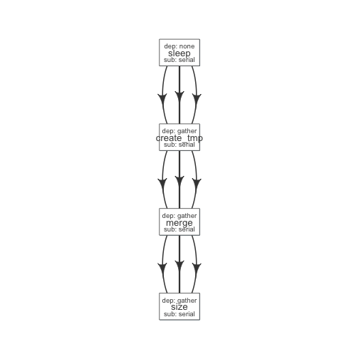

# Example1


```r
read_chunk(system.file('pipelines', 'sleep_pipe.R', package = 'flowr'))
```


## Define modules

```r
#' @param x number of sleep commands
sleep <- function(x, samplename){
	cmd = list(sleep = sprintf("sleep %s && sleep %s;echo 'hello'",
		abs(round(rnorm(x)*10, 0)),
		abs(round(rnorm(x)*10, 0))))
	flowmat = to_flowmat(cmd, samplename)
	return(list(flowmat = flowmat))
}

#' @param x number of tmp commands
create_tmp <- function(x, samplename){
	## Create 100 temporary files
	tmp = sprintf("%s_tmp_%s", samplename, 1:x)
	cmd = list(create_tmp = sprintf("head -c 100000 /dev/urandom > %s", tmp))
	## --- convert the list into a data.frame
	flowmat = to_flowmat(cmd, samplename)
	return(list(flowmat = flowmat, outfiles = tmp))
}

#' @param x vector of files to merge
merge_size <- function(x, samplename){
	## Merge them according to samples, 10 each
	mergedfile = paste0(samplename, "_merged")
	cmd_merge <- sprintf("cat %s > %s",
		paste(x, collapse = " "), ## input files
		mergedfile)
	## get the size of merged files
	cmd_size = sprintf("du -sh %s; echo 'MY shell:' $SHELL", mergedfile)

	cmd = list(merge = cmd_merge, size = cmd_size)
	## --- convert the list into a data.frame
	flowmat = to_flowmat(cmd, samplename)
	return(list(flowmat = flowmat, outfiles = mergedfile))
}
```

## Define the pipeline

```r
#' @param x number of files to make
sleep_pipe <- function(x = 3, samplename = "samp1"){

	## call the modules one by one...
	out_sleep = sleep(x, samplename)
	out_create_tmp = create_tmp(x, samplename)
	out_merge_size = merge_size(out_create_tmp$outfiles, samplename)

	## row bind all the commands
	flowmat = rbind(out_sleep$flowmat,
		out_create_tmp$flowmat,
		out_merge_size$flowmat)

	return(list(flowmat = flowmat, outfiles = out_merge_size$outfiles))
}
```

## Generate flowmat

```r
out = sleep_pipe(x = 3, "sample1")
flowmat = out$flowmat

kable(flowmat)
```


|samplename |jobname    |cmd                                                            |
|:----------|:----------|:--------------------------------------------------------------|
|sample1    |sleep      |sleep 20 && sleep 7;echo 'hello'                               |
|sample1    |sleep      |sleep 7 && sleep 8;echo 'hello'                                |
|sample1    |sleep      |sleep 15 && sleep 3;echo 'hello'                               |
|sample1    |create_tmp |head -c 100000 /dev/urandom > sample1_tmp_1                    |
|sample1    |create_tmp |head -c 100000 /dev/urandom > sample1_tmp_2                    |
|sample1    |create_tmp |head -c 100000 /dev/urandom > sample1_tmp_3                    |
|sample1    |merge      |cat sample1_tmp_1 sample1_tmp_2 sample1_tmp_3 > sample1_merged |
|sample1    |size       |du -sh sample1_merged; echo 'MY shell:' $SHELL                 |

## Create flow definition
### We have a helper function which generates a skeleton flow_def

```r
def = to_flowdef(flowmat)
```

```
#> Creating a skeleton flow definition
#> Following jobnames detected: sleep create_tmp merge size
```

```r
kable(def)
```


|jobname    |sub_type |prev_jobs  |dep_type |queue |memory_reserved |walltime | cpu_reserved|platform | jobid|
|:----------|:--------|:----------|:--------|:-----|:---------------|:--------|------------:|:--------|-----:|
|sleep      |serial   |none       |none     |short |2000            |1:00     |            1|torque   |     1|
|create_tmp |serial   |sleep      |gather   |short |2000            |1:00     |            1|torque   |     2|
|merge      |serial   |create_tmp |gather   |short |2000            |1:00     |            1|torque   |     3|
|size       |serial   |merge      |gather   |short |2000            |1:00     |            1|torque   |     4|

## Default flowdef

```r
plot_flow(to_flow(flowmat, def))
```

 

By default the flowdef seems quite conservative.

### Change the dependency type for merge step into gather
It might be easier to do such, by hand. In this example let do this in R itself.

```r
def$sub_type = c("scatter", "scatter", "serial", "serial")
def$dep_type = c("none", "serial", "gather", "serial")
kable(def)
```


|jobname    |sub_type |prev_jobs  |dep_type |queue |memory_reserved |walltime | cpu_reserved|platform | jobid|
|:----------|:--------|:----------|:--------|:-----|:---------------|:--------|------------:|:--------|-----:|
|sleep      |scatter  |none       |none     |short |2000            |1:00     |            1|torque   |     1|
|create_tmp |scatter  |sleep      |serial   |short |2000            |1:00     |            1|torque   |     2|
|merge      |serial   |create_tmp |gather   |short |2000            |1:00     |            1|torque   |     3|
|size       |serial   |merge      |serial   |short |2000            |1:00     |            1|torque   |     4|

### Plot flow

Now this looke better. 

- multiple sleep commands would run in parallel
- For each sleep, create_tmp creates a file
- All tmp files are merged; when all are complete: gather
- Then we get size on the resulting file


```r
plot_flow(to_flow(flowmat, def))
```

 


