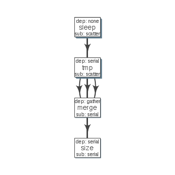

Get me started
-------------


```r
install.packages('devtools')
devtools::install_github("sahilseth/flowr")
```

Run a setup function which copies 'flowr' Rscript to subsetquent steps easier.
More on this [here](https://github.com/sahilseth/rfun).


```r
library(flowr)
setup()
```


# Toy example


A simple example where we have three instances of sleep (wait for few seconds), after waiting three tmp jobs are started which create three files with some random data. After all three are complete, a merge step merges the file and then size of the resulting file is calculated. This is quite similar in structure to a typical workflow from where a series of alignment and sorting steps may take place on the raw fastq files. Followed by merging of the resulting bam files into one large file per-sample.

The table above is referred to as [flow_mat](details...).


|samplename |jobname |cmd                                  |
|:----------|:-------|:------------------------------------|
|sample1    |sleep   |sleep 2 && sleep 5;echo hello        |
|sample1    |sleep   |sleep 13 && sleep 7;echo hello       |
|sample1    |sleep   |sleep 23 && sleep 7;echo hello       |
|sample1    |tmp     |head -c 100000 /dev/urandom > tmp1_1 |
|sample1    |tmp     |head -c 100000 /dev/urandom > tmp1_2 |
|sample1    |tmp     |head -c 100000 /dev/urandom > tmp1_3 |
|sample1    |merge   |cat tmp1_1 tmp1_2 tmp1_3 > merge1    |
|sample1    |size    |du -sh merge1; echo MY shell: $SHELL |

We use an additional file specifying relationship between the steps, and also other resource requirements [flow_def](details...).


|jobname |prev_jobs |dep_type |sub_type |queue  | memory_reserved|walltime | cpu_reserved|
|:-------|:---------|:--------|:--------|:------|---------------:|:--------|------------:|
|sleep   |none      |none     |scatter  |medium |          163185|23:00    |            1|
|tmp     |sleep     |serial   |scatter  |medium |          163185|23:00    |            1|
|merge   |tmp       |gather   |serial   |medium |          163185|23:00    |            1|
|size    |merge     |serial   |serial   |medium |          163185|23:00    |            1|


```r
## load these files
exdata = file.path(system.file(package = "flowr"), "extdata")
flow_mat = read_sheet(file.path(exdata, "example1_flow_mat.txt"))
flow_mat = subset(flow_mat, samplename == "sample1")
flow_def = read_sheet(file.path(exdata,  "example1_flow_def.txt"))
```

# Stitch


```r
fobj <- to_flow(x = flow_mat, def = flow_def, 
	flowname = "example1", platform = "lsf")
```

# Plot

```r
plot_flow(fobj)
```

 


# Test it
> Dry run (submit)


```r
submit_flow(fobj)
```

```
Test Successful!
You may check this folder for consistency. Also you may re-run submit with execute=TRUE
 ~/flowr/type1-20150520-15-18-27-5mSd32G0
```

# Submit it !

> Submit to the cluster


```r
submit_flow(fobj, execute = TRUE)
```

```
Flow has been submitted. Track it from terminal using:
flowr::status(x="~/flowr/type1-20150520-15-18-46-sySOzZnE")
OR
flowr status x=~/flowr/type1-20150520-15-18-46-sySOzZnE
```


# Check the status

```
flowr status x=~/flowr/type1-20150520-15-18-46-sySOzZnE
```

```
Loading required package: shape
Flowr: streamlining workflows
Showing status of: /rsrch2/iacs/iacs_dep/sseth/flowr/type1-20150520-15-18-46-sySOzZnE


|          | total| started| completed| exit_status|
|:---------|-----:|-------:|---------:|-----------:|
|001.sleep |    10|      10|        10|           0|
|002.tmp   |    10|      10|        10|           0|
|003.merge |     1|       1|         1|           0|
|004.size  |     1|       1|         1|           0|
```

.. note::
Interested? Here are some details on [building pipelines](http://docs.flowr.space/en/latest/rd/vignettes/build-pipes.html)
