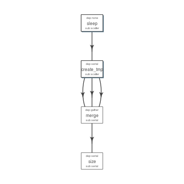

Get started
-----------

.. code:: r

    install.packages('devtools')
    devtools::install_github("sahilseth/flowr")

Run a setup function which copies 'flowr' helper script to enable using flow from shell terminal itself. A few examples `here <https://github.com/sahilseth/rfun>`__.

.. code:: r

    library(flowr)
    setup()

Toy example
===========

.. figure:: imgs/toy.png
   :alt: 

A simple example where we have three instances of sleep (wait for few seconds), after completion three tmp jobs are started which create files with some random data. After all these are complete, a merge step follows, which combines them into one big file. Next we use ``du`` to calculate the size of the resulting file.

.. note:: This is quite similar in structure to a typical workflow from where a series of alignment and sorting steps may take place on the raw fastq files. Followed by merging of the resulting bam files into one large file per-sample and further downstream processing.

The table below is referred to as `flow\_mat <http://docs.flowr.space/en/latest/rd/vignettes/build-pipes.html#flow-mat-a-table-with-shell-commands-to-run>`__.

+--------------+---------------+-------------------------------------------------------------------------+
| samplename   | jobname       | cmd                                                                     |
+==============+===============+=========================================================================+
| sample1      | sleep         | sleep 10 && sleep 2;echo hello                                          |
+--------------+---------------+-------------------------------------------------------------------------+
| sample1      | sleep         | sleep 11 && sleep 8;echo hello                                          |
+--------------+---------------+-------------------------------------------------------------------------+
| sample1      | sleep         | sleep 11 && sleep 17;echo hello                                         |
+--------------+---------------+-------------------------------------------------------------------------+
| sample1      | create\_tmp   | head -c 100000 /dev/urandom > sample1\_tmp\_1                           |
+--------------+---------------+-------------------------------------------------------------------------+
| sample1      | create\_tmp   | head -c 100000 /dev/urandom > sample1\_tmp\_2                           |
+--------------+---------------+-------------------------------------------------------------------------+
| sample1      | create\_tmp   | head -c 100000 /dev/urandom > sample1\_tmp\_3                           |
+--------------+---------------+-------------------------------------------------------------------------+
| sample1      | merge         | cat sample1\_tmp\_1 sample1\_tmp\_2 sample1\_tmp\_3 > sample1\_merged   |
+--------------+---------------+-------------------------------------------------------------------------+
| sample1      | size          | du -sh sample1\_merged; echo MY shell: $SHELL                           |
+--------------+---------------+-------------------------------------------------------------------------+

We use an additional file specifying relationship between the steps, and also other resource requirements `flow\_def <http://docs.flowr.space/en/latest/rd/vignettes/build-pipes.html#flow-definition>`__.

+---------------+-------------+---------------+-------------+---------+--------------------+------------+-----------------+------------+---------+
| jobname       | sub\_type   | prev\_jobs    | dep\_type   | queue   | memory\_reserved   | walltime   | cpu\_reserved   | platform   | jobid   |
+===============+=============+===============+=============+=========+====================+============+=================+============+=========+
| sleep         | scatter     | none          | none        | short   | 2000               | 1:00       | 1               | torque     | 1       |
+---------------+-------------+---------------+-------------+---------+--------------------+------------+-----------------+------------+---------+
| create\_tmp   | scatter     | sleep         | serial      | short   | 2000               | 1:00       | 1               | torque     | 2       |
+---------------+-------------+---------------+-------------+---------+--------------------+------------+-----------------+------------+---------+
| merge         | serial      | create\_tmp   | gather      | short   | 2000               | 1:00       | 1               | torque     | 3       |
+---------------+-------------+---------------+-------------+---------+--------------------+------------+-----------------+------------+---------+
| size          | serial      | merge         | serial      | short   | 2000               | 1:00       | 1               | torque     | 4       |
+---------------+-------------+---------------+-------------+---------+--------------------+------------+-----------------+------------+---------+

Stitch
======

.. code:: r

    fobj <- to_flow(x = flow_mat, def = as.flowdef(flow_def), 
        flowname = "example1", platform = "lsf")

Plot
====

.. code:: r

    plot_flow(fobj)

   Flow chart describing process for example 1
Test it
=======

    Dry run (submit)

.. code:: r

    submit_flow(fobj)

::

    Test Successful!
    You may check this folder for consistency. Also you may re-run submit with execute=TRUE
     ~/flowr/type1-20150520-15-18-27-5mSd32G0

Submit it !
===========

    Submit to the cluster

.. code:: r

    submit_flow(fobj, execute = TRUE)

::

    Flow has been submitted. Track it from terminal using:
    flowr::status(x="~/flowr/type1-20150520-15-18-46-sySOzZnE")
    OR
    flowr status x=~/flowr/type1-20150520-15-18-46-sySOzZnE

Check the status
================

::

    flowr status x=~/flowr/type1-20150520-15-18-46-sySOzZnE

::

    Loading required package: shape
    Flowr: streamlining workflows
    Showing status of: /rsrch2/iacs/iacs_dep/sseth/flowr/type1-20150520-15-18-46-sySOzZnE

    |          | total| started| completed| exit_status|
    |:---------|-----:|-------:|---------:|-----------:|
    |001.sleep |    10|      10|        10|           0|
    |002.tmp   |    10|      10|        10|           0|
    |003.merge |     1|       1|         1|           0|
    |004.size  |     1|       1|         1|           0|

.. note:: Interested? Here are some details on `building pipelines <http://docs.flowr.space/en/latest/rd/vignettes/build-pipes.html>`__
